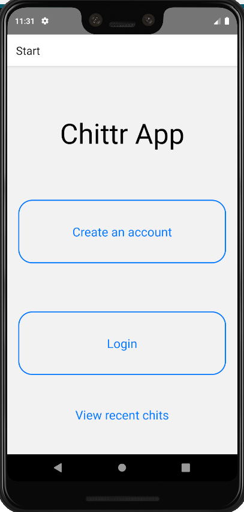
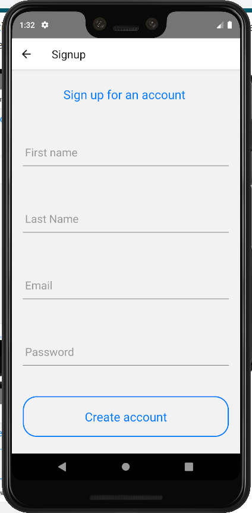
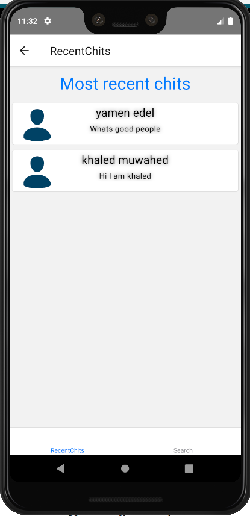
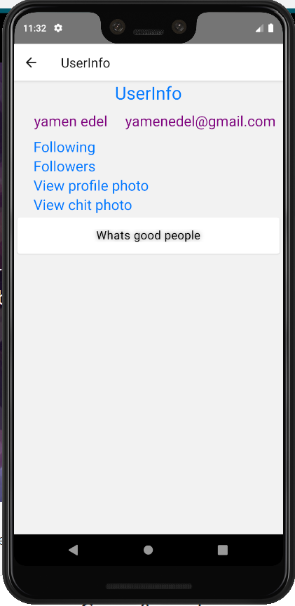
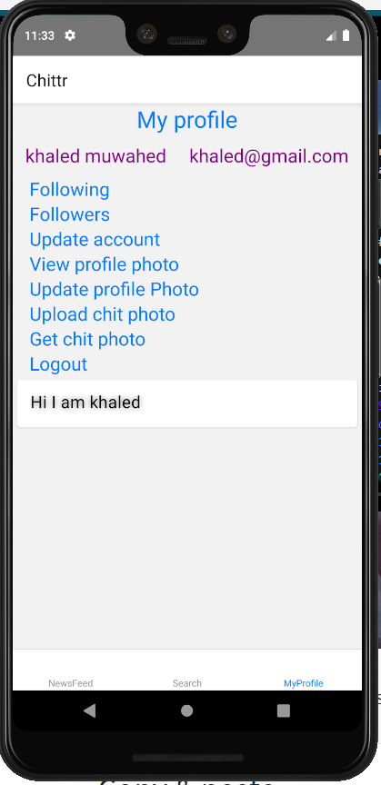
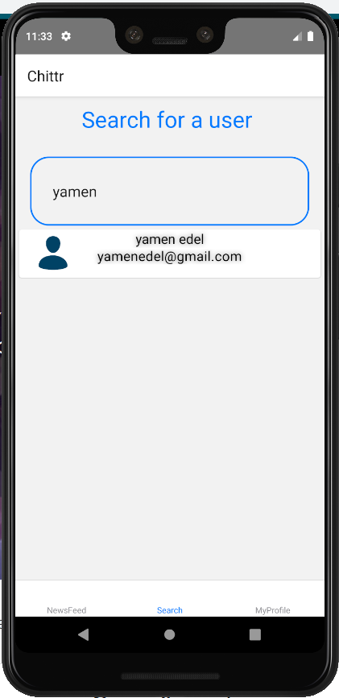
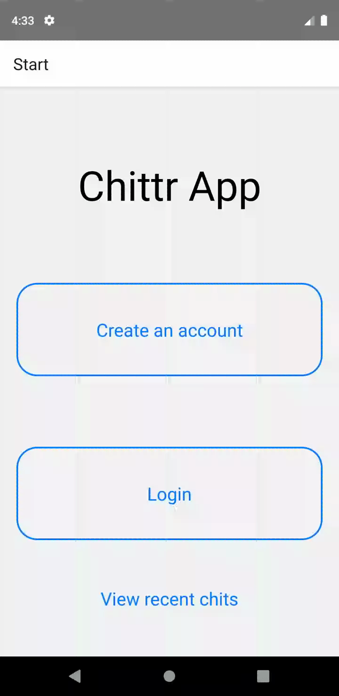

# Chittr App

Chitr App is a mobile application developed using React Native framework and written in JavaScript

## Description
Chittr is a platform for microblogging that's similar to how twitter works. Users 
can sign up and login into their account to be able to post 'Chits' - short,textual based posts no longer than 141 characters and view what other people are chitting about. Users also can view the chits without logging in.
The logged users have even more things to do include uploading a profile photo or a photo to a chit.  

## Visuals
These are screenshots of the application and how it looks like include : The start screen - recent chits - user information - logged user profile - post a chit screen - search for a user

  


## Installation

I will list the required steps to run the applications but first you would need to have the Android Studio development framework installed on your machine, Click [here](https://developer.android.com/studio) to redirect you to the instructions of how to install it. Then you have to install React Native CLl on your machine. The instructions for installation are located [here](https://facebook.github.io/react-native/docs/getting-started).

Now open the Android studio and click on file then open from the top left android studio screen then navigator to the project folder and select android. "./TestProject/android". You will need to create a new AVD if you don't have one already. Click "Tools" > "AVD Manager" following the steps. Once it's created run the emulator by clicking the green triangle button on top.

Now you should add the following lines to the Manifests in order to allow access to the internet, camera and location :
```bash
<uses-permission android:name="android.permission.INTERNET" />
<uses-permission android:name="android.permission.CAMERA" />
<uses-permission android:name="android.permission.SEND_SMS"/>
```

Also add the following lines into Manifests within the <applciation>:
```bash
<meta-data android:name="com.google.android.geo.API_KEY"
android:value="YOUR API KEY"/>
```
Now click on the build.gradle(Module:app), onto the defaultConfig compare and add the missing ones from following lines:
```bash
defaultConfig {
applicationId "com.chitr"
minSdkVersion rootProject.ext.minSdkVersion
targetSdkVersion rootProject.ext.targetSdkVersion
missingDimensionStrategy 'react-native-camera', 'general'
versionCode 1
versionName "1.0"
multiDexEnabled true
}
```
Make sure now to Sync project with new changes from file on the top corner of android studio screen.

The next step, open your terminal and navigate to the project directory. Then run this command to install all the modules and packages used within the project :

```bash
npm install
```
Then to install this module :
```bash
npm install react-native-maps
```

Then run this command to open up the application :
```bash
npx react-native run-android
```
Now you are all set the and application should open on your AVD 

## Support
If you have any issues with the project and want to get help, or even having an idea to enhance/add something I am always happy to hear from you via emails on : yamenadel4@gmail.com .

## Roadmap
I am planning on improving the responsiveness of the map and make it quicker in the future. 

## Contributing
Pull requests are welcome. For major changes, please open an issue first to discuss what you would like to change in the application. Please feel free to email me in regards any contribution you would like to add using my email address above in support section. Follow this [link](https://github.com/YamenEdel/chitr) to download the repository on GitHub. 


